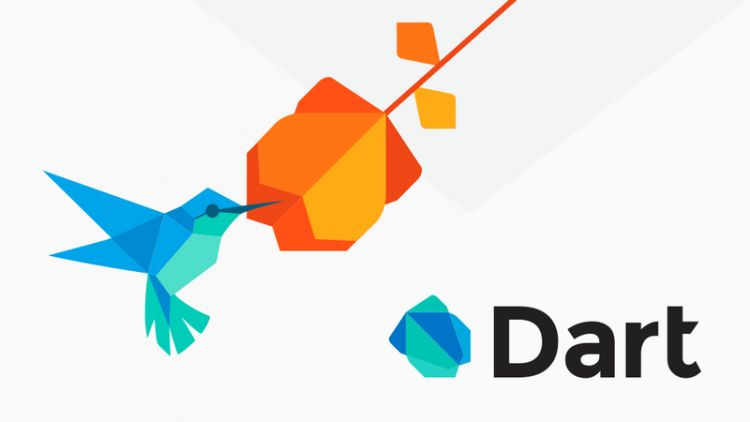

---
# Informació general del document
title: Tema 1 - Lenguaje DART
autor: Sandra Martínez
lang: es
page-background: img/background.png

# Portada
titlepage: true
titlepage-rule-height: 0
#titlepage-rule-color: 000000
titlepage-text-color: 2a5299
titlepage-background: img/portada.png


# Taula de continguts
toc: true
toc-own-page: true
toc-title: Index

# Capçaleres i peus
header-left: Tema 1 - Lenguaje Dart
header-right: Curso 2023-2024
footer-left: IES La Nía
footer-right: \thepage/\pageref{LastPage}

# Imatges
float-placement-figure: H
caption-justification: centering

# Llistats de codi
listings-no-page-break: true
listings-disable-line-numbers: false

header-includes:
  - \usepackage{lastpage}
    \usepackage{awesomebox}
    \usepackage{caption}
    \usepackage{array}
    \usepackage{tabularx}
    \usepackage{ragged2e}
    \usepackage{multirow}
    \usepackage{xcolor}

  
pandoc-latex-environment:
  noteblock: [note]
  tipblock: [tip]
  warningblock: [warning]
  cautionblock: [caution]
  importantblock: [important]

# marca d'aigua
# - \usepackage{draftwatermark}
# - \SetWatermarkText{\includegraphics{./img/logo50water.png}}
# - \SetWatermarkScale{0.5}
# - \SetWatermarkAngle{20}

# text en columnes
# - \usepackage{multicol}
# - \setlength{\columnseprule}{1pt}
# - \setlength{\columnsep}{1em}

# per a permetre pandoc dins de blocs Latex
# - \newcommand{\hideFromPandoc}[1]{#1}
# - \hideFromPandoc {
# \let\Begin\begin
# \let\End\end
---


  
<br>

# Introducción

**Dart** es un lenguaje de programación versátil y moderno desarrollado por Google que se ejecuta tanto en el navegador web como en el servidor. Es ideal para crear aplicaciones web, aplicaciones móviles multiplataforma con Flutter y backends escalables.

Este documento te guiará a través de los conceptos básicos de la sintaxis de Dart, proporcionando ejemplos de código y explicaciones sencillas para ayudarte a iniciarte en la programación en este lenguaje.

## Tipos de Datos

Dart posee un sistema de tipos seguro que ayuda a prevenir errores en tiempo de ejecución. Algunos de los tipos de datos básicos son:


* **Números:** `int` para enteros y `double` para decimales.
* **Cadenas:** `String` para secuencias de caracteres.
* **Booleanos:** `bool` para valores `true` o `false`.
* **Listas:** `List` para colecciones ordenadas de elementos.
* **Mapas:** `Map` para colecciones de pares clave-valor.


\importantbox{Importante definir de manera clara y rigurosa cada tipo de dato.}


**Ejemplos:**


```Dart
var numeroEntero = 10; // int
var numeroDecimal = 3.14; // double
var nombre = "Bard"; // String
var esVerdadero = true; // bool
var listaDeNumeros = [1, 2, 3]; // List<int>
var mapaDePaises = {"España": "Madrid", "Francia": "París"}; // Map<String, String>
```

## Variables

Las variables se utilizan para almacenar datos en la memoria. Para declarar una variable, se indica el tipo de dato seguido del nombre de la variable y un punto y coma:


```Dart
var nombre; // Variable sin inicializar
var edad = 25; // Variable inicializada
```

## Operadores

Dart ofrece una amplia gama de operadores para realizar operaciones matemáticas, lógicas y comparativas. Algunos ejemplos son:


* **Aritméticos:** `+`, `-`, `*`, `/`, `%`
* **Lógicos:** `&&`, `||`, `!`
* **Comparativos:** `==`, `!=`, `<`, `>`, `<=`, `>=`

\warningbox{Cuidado con el orden de prioridad de los operadores.}

**Ejemplos:**

```Dart
var suma = 10 + 5; // 15
var diferencia = 10 - 5; // 5
var producto = 10 * 5; // 50
var cociente = 10 / 5; // 2.0
var resto = 10 % 3; // 1

var esMayor = 10 > 5; // true
var esIgual = 10 == 10; // true
var esDistinto = 10 != 5; // true
```

## Estructuras de control

Las estructuras de control permiten ejecutar diferentes bloques de código según ciertas condiciones. Las más comunes son:


* **Sentencias condicionales:** `if`, `else`, `else if`
* **Bucles:** `for`, `while`, `do while`

**Ejemplos:**

```Dart
var numero = 10;

if (numero > 0) {
  print("El número es positivo");
} else {
  print("El número es negativo");
}

for (var i = 0; i < 5; i++) {
  print("Iteración $i");
}

var contador = 0;
while (contador < 5) {
  print("Iteración $contador");
  contador++;
}
```

## Funciones

Las funciones son bloques de código reutilizables que pueden recibir parámetros y devolver un valor. Se definen con la palabra clave `function` seguida del nombre de la función, los parámetros entre paréntesis y el tipo de dato de retorno:

```Dart
void saludar(String nombre) {
  print("Hola $nombre!");
}

String obtenerNombre() {
  return "Bard";
}

void main() {
  saludar("Usuario");
  var nombre = obtenerNombre();
  print("El nombre es $nombre");
}
```

## Clases y Objetos

Dart es un lenguaje orientado a objetos, lo que permite crear clases y objetos. Las clases son plantillas para crear objetos con sus propios atributos y métodos.

**Ejemplos:**

```Dart
class Persona {
  String nombre;
  int edad;

  Persona(this.nombre, this.edad);

  void saludar() {
    print("Hola, mi nombre es $nombre y tengo $edad años");
  }
}

void main() {
  var persona1 = Persona("Juan", 25);
  persona1.saludar();
}